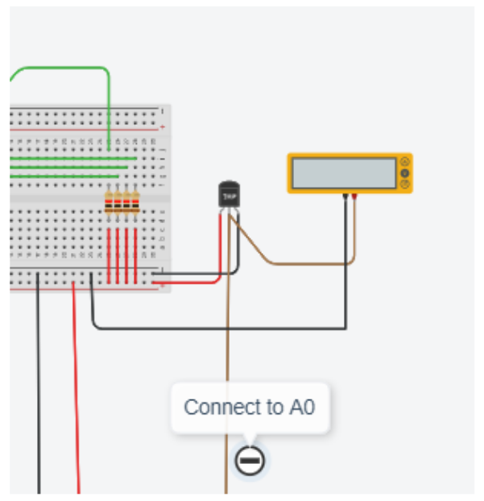

# Work package nr 5 / *Keyboard interrupt and simple temperature meter*


## Exerc_5_1

In this exercise we will further develop the keyboard system from exercise 4_5.

The main idea is to, instead of continuously checking the keyboard, read the key in an interrupt service routine (**ISR**). Just like we did in the lecture. 

The key reading function from earlier exercise should now be called as an interrupt service routine as soon as any key is pressed. The number of the pressed key should then be written out in the monitor by the main program. 

You shall use the hardware interrupt INT0 on the Arduino system. To get an interrupt call you should use the pin named PD2 (INT0) on the Arduino board as input for the hardware interrupt. To configure the system for manage of an interrupt you shall use the Arduino setup() function call:

`attachInterrupt (digitalPinToInterrupt(2), irqserviceroutine_name, FALLING);` 

The function (a void type function) will be called if the level on the INT0 pin change from high to low level. (If named RISING instead of FALLING it will be called for the opposite level change).

To get a hardware indication of a pressed key we will use four input NAND gates, one for each column.

An AND gate (Logical And) is a digital circuit that realizes the AND logical function.


The function can be described by a truth table showing all possible states for in and out as the table besides. The schematic symbols for an AND gate is as figure besides.

A four input AND gate gives in the same way only high (1) out when all in are high (1, 1, 1, 1). All other combinations for in-signal will give out as low (0).

If we connect all four inputs in a AND- gate to the column wires of our keyboard system, the out-pin will be low for all combinations except from the state with four high input. This means that when no key is pressed or when a key in a row with high state is pressed the output from the AND gate will be high. The output will only be low when a key in a row with low state is pressed. If we connect the out-signal to the Arduino INT0 pin this will generate an interrupt request to the system.

A dual, four input digital logic AND gate in a chip is normally labeled 74HC21. You can find such a chip in Tinkercad and connect it to our system. You find all input and output to each gate on the chip when pointing to them.

**To do:**

Connect a four input AND gate to your keyboard system as described above so a pressed key in a row with low value (0) will generate an interrupt.


To make the system generate an interrupt for any key pressed you will in the main program set all rows to low. Any key pressed will by that generate an interrupt and call the interrupt service routine (IRS). The IRS should then decode what key is pressed and “return” the key number to the main program that print it to the serial monitor. If no key is pressed the main program just loop around as below pseudo code shows.

```C
void setup(){
...
}
void loop(){
...
if(keyhit){
Serial.println(keynumber);
...
}
void keyboardirq(void){
// Read key number ------
...
}
```

**Examination of the solution:**
Demonstrate the function for a TA and get the examination code. Put the code in the program header, copy the program list to a word document. Take a “picture” of the circuit and copy it to the same document.

Describe as god as possible what the below line is done:
`attachInterrupt (digitalPinToInterrupt(2), irqserviceroutin name , FALLING);`

Save the document as a pdf and hand in as a solution for exercise 5.

## Exerc_5_2

In this exercise you should extend the function of your keyboard system with a temperature meter.
To do so add a temperature sensor (TMP36) to the system as the figure below shows.

The main idea is that the main-loop in the program, with short delay (500ms), checks the temperature by reading the input voltage on AD – input A0 - calculates the corresponding temperature and print it on the serial monitor.


AD converter with 10 bits resolution. You can use the Arduino IDE:s function (analogRead()) to read A0. Calculate the temperature using this formula:

Temp sensor TMP36: Output 750 mV at 25 °C, sensor gain 10 mV/ °C

You can also add the Multimeter to be able to check the printed temperature for a certain in-voltage.

Extend the main program from 5_1 with this function so that the system normally writes out the temperature at the beginning. If you press any key on the keyboard, the system reads the key and print out the key number and the temperature. The printing can be done either with a console or using some sort of LCD attached to the breadboard. 