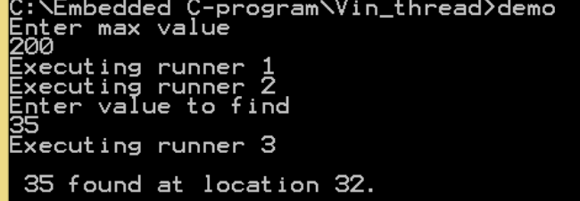
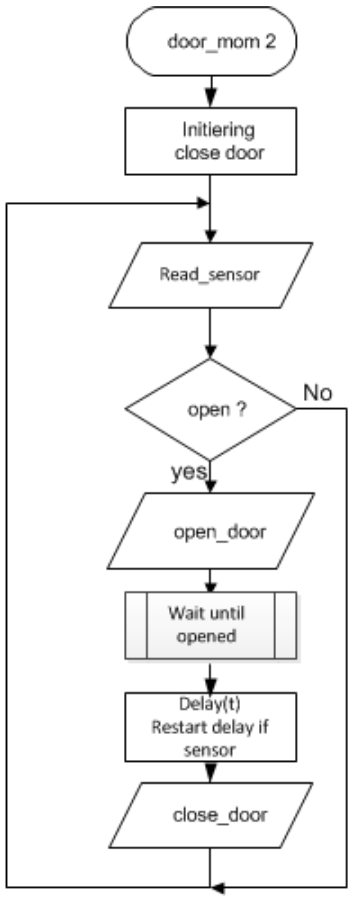
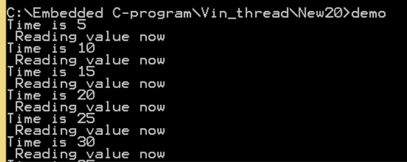
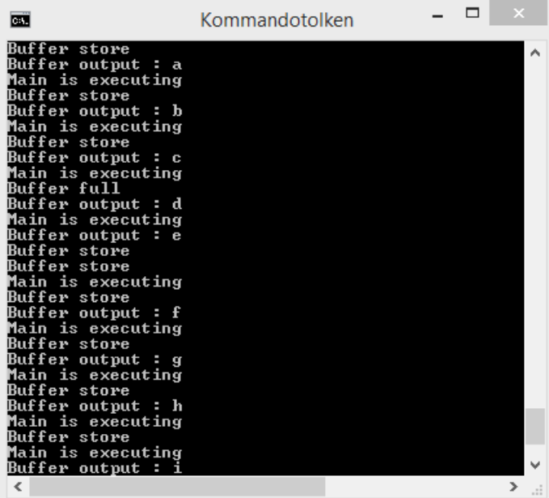

# Work package nr 5 / *Processes and threads*


## Exerc_6_1

This exercise is based on the provided [*sortandfind_20.c*](skeleton/sortandfind_20.c) file. The code performs the following operations:

1. It creates an array of integer numbers with the given number of elements.
2. Fills such array with random integer numbers whose max value is given by the user. There is a dummy delay in this random generator part just to view the problem in question 5. 
3. Sorts the array.
4. Looks for a specific value given by the user using binary search.

**Answer the following questions:**

1. How many threads (in total) are created during the execution of the program?
2. What are lines 16, 17,  20, 25 and 26 intended for?
3. How many parameters are passed to function runner?
4. How can function runner know the values for parameters that, such as max value, not are passed to it?
5. Test how the behavior of the program changes if line 26 is omitted. Explain why.

**To do** : Study the program and write your answer in a simple text document exerc6_1.txt and view it for the TA and they will give you a pass code if ok. Hand it in together with the other files.

## Exerc_6_2 | More about threads



Rewrite the application in sortandfind_20.c  so that each of the three main steps (filling the array / sorting the array and finally finding the value given by the user are executed by 3 different threads and work as expected. Clarify the function of each thread with a printf( ) stating which of the 3 steps the thread is running. Possible output could be as below.


## Exerc_6_3 | Time based control program


In this exercise you should develop a draft for a program, possible to compile but not possible to run or test. **You should just show and explain the solution for the TA.** 

You shall develop a time-based implementation of an automatic door. The door is a sliding door which when open signal activates opens slowly to full open (opened) and when close signal activates closes slowly to closed. The open-door signal activates when someone is near the door. The close signal is activated by the control program when time to close the door. 

The door will operate in the following manner:

- If someone approaches the door space the door will open.
- After the door had been open (in several seconds, controlled by a simple loop) the door should start to close.
- The door is closing very slowly, takes several seconds to close. If someone approaches the door space while the door is closing, it shall immediately reopen.
- The main structure of the program is described roughly by the following flowchart:

The implementation will be done entirely in the programming language C and in one single module (file).

**Control of the door unit.**
<br>
The door is connected to the computer system and controlled via four different 8 bits registers all possible to read or write to depending on the register.



**About the registers for this task:**
<br>
**Control register:** Address 0x0B00 (write operation).

By bit 0 you can start opening the door, it will open slowly so it will take some time before it is fully open. By bit 1 you can start closing the door,  it will close slowly. Closing and opening of the door could be done anytime even if the door is in its opening or closing phase. 

Bit 7-2, &emsp;Not used.
<br>
Bit 1, &emsp; CLOSE &emsp;write 1 = > Actuate "Close the Door"
<br>
Bit 0, &emsp; OPEN &emsp;  write 1 = > Actuate "Open the Door". 
<br>
Bits will be cleared (set to 0) by the system after the operation started.

**Status register**: Address 0x0B10 ( read operation). Each bit is represented the status of the door or the sensor. For example, door is closed, door is opened.  You can by reading the bits in this register check the actual statusof the door.

Bit 7, &emsp; CLOSING. &emsp; 1 = Door is closing slowly.
<br>
Bit 6, &emsp; OPENING. &emsp; 1 = Door is opening slowly.
<br>
Bit 5, &emsp; S2: Sense 2. &emsp; 1 = Door is closed
<br>
Bit 4, &emsp; S1: Sense 1. &emsp; 1 = Door is wide open.
<br>
Bit 3, &emsp; Sensor ;  1 = Sensor is activated, someone close to the door
<br>
Bit 2, &emsp; Not of interest
<br>
Bit 1, &emsp; Not of interest 

**Note:** When reading a specific bit, you can’t be sure that the other bits are 0.

**To do:**
<br>
Your task is to write a draft for a control program.  Below you have a program head with some declarations. Try to make a draft for a control program that solve the problem with a structure as flowchart above views. The Delay() function can be implemented as a simple for for-loop with a counter.
<br>
Compile the program to ensure the syntax. You can ́t test the program. The only thing you can do is to explain the program to the TA and they will respond if it seems to be a working solution or not. If rather good he/she will give you a pass code and you can hand in the solution.

```C
#define ML13_Status 0x0B10
#define ML13_Control 0x0B00 
                            
void main () { 
    ...
    
}
```

## Exerc_6_4 | Timer-controlled I/O management

To control events in a program, you can use a "process" (in this case a thread)  that manage a global system time variable tick. For example, the time could tick with a resolution of 0,1 seconds.

With help of this function you can read the system-time in ms:

```C
#include <sys/time.h>

double get_time_ms() {
    struct timeval t;
    gettimeofday(&t, NULL);
    return (t.tv_sec + (t.tv_usec / 1000000.0)) * 1000.0;
}
```

If you let a thread function call this get_time_ms() and by help of this count a global program time counter variable program_time with a resolution of 1 s.

Then it is possible to control all other events with help of the program_time. For example, you can read a specific in-port every x seconds.

**To do**: Write a program with the following structure:

```C
int program_time;   // The global time, start value 0

int main() {
    // Start up the thread time_count.     
    // Start up the thread read_inport.
    while ( program_time < 50) { 
        //Print out system time every second.      

    }
}

// --- End of main thread ------

// ----- Tread functions – 
// --------------------------------------------

void *time_count( ....) {
    while ( program_time < 50) {
        // Check system-time ( get_time_ms())
        // Increase program_time by one every second
    }
    
    // exit thread;
}
//End------------------------------------

void *read_inport(...) {
    while (program_time<50){
        // Read Inport every 5 second.
        // ( Simulate this just by print out a text : Reading Inport now)
    }
    
    // exit thread;
}
//End------------------------------------

// -------- Function get_time_ms --------------------
double get_time_ms(){
    ...
} // ------------ End -------------------
```

Tip: Try to do the printing of program time every second on same row until a printout of reading inport is done. 

Example of console text:



## Exerc_6_5 | Testing synchronization of threads in C-programming

By using a library pthread.h you can create several theads (light weight processes) from your program. This task for you in these exercises is to test threads and some synchronization primitives such as mutex (simple semaphore) and condition variables signals.  

You can read related information about this [here](http://www.yolinux.com/TUTORIALS/LinuxTutorialPosixThreads.html).
<br>
Read and study about: Basics, Creation and termination, Synchronizations.

The main task for you is to try to develop a program demonstrating a global circular buffer in which it should be possible for threads to write (put in) and read (fetch out) characters in the buffer. All writing and reading from buffer should be without losing data or taking it out in wrong order. 

The Buffer and its two index number is global 

Global / Shared variables

```C
char buffer[MAX];   // circular buffer . Test for MAX 5 and 10.
int inpos;          // index for next character to be put in buffer.
int outpos;         // index for next character to be read ( fetch )
int count;          // the number of characters in buffer not fetched.
```

For synchronization between threads there are some function in the pthread library you shall use:

`pthread_mutex_init()`, `pthread_mutex_lock()`, `phtread_mutex_unlock()` and `pthread_cond_signal()`, `pthread_cond_wait()`.

To compile the program you have to add the library pthread when compiled as follows:

```shell
gcc  filename.c  -o program  -lpthread
```

**The program should have the following structure and function.**
<br>
A main program for setting up and start running two threads as described below. The main program should after started up the threads continue in a loop as you can see in the program skeleton below. 
<br>
(You find the code at the homepage in file [**skeleton_exerc_6_5.c**](skeleton/skeleton_exerc_6_5.c))

The first thread, ***put()***, should create characters a,b,c...z ; a,b,c.... and store them in the buffer in an infinitive loop. For every character stored it should call a conditional signal (cond_signal) telling other threads that buffer not empty. If buffer full (MAX number of characters in buffer) the **put()** thread should wait for a cond_signal‘not full’ from the other consuming thread telling that the buffer is not full. The second thread, **fetch()**, should fetch out the character in first position to be fetched from the buffer and print it out in the console window.  If no character in buffer it should wait for a cond_signal ‘not empty’ from the producer thread that signal every time it stores a new character in buffer. The result should be that the program prints out ‘abcdef...z’’abcd...z’ in correct alphabetical order. Between the letters the main() thread in a loop prints out a text string when it is running as the picture in figure below shows as one possible example of output. Do not need to be exactly same output but the characters should be in the expected order.

An example of the suggested output should be as follows:

